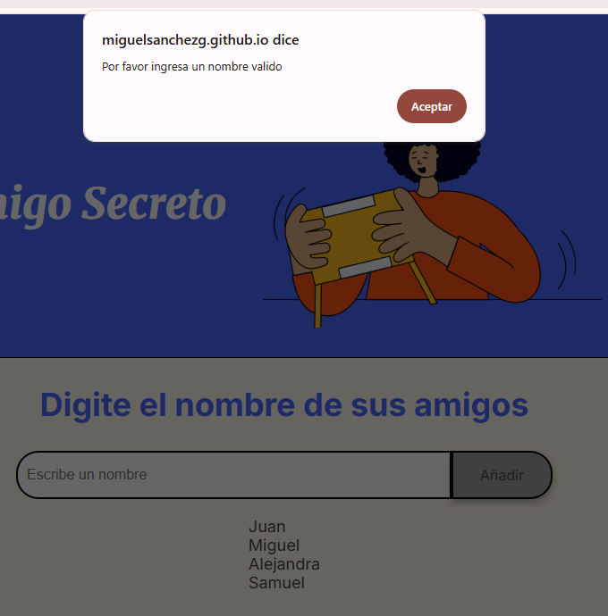

# ChallengeAmigosecreto

Este challenge ayuda a generar un sorteo para una lista de amigos que sea brindada. Se puede abrir el proyecto desde el link brindado a continuación, luego se repasaran varios puntos aclarando varias funcionalidades o informacion que crea necesaria para que se pueda usar sin problemas.
https://miguelsanchezg.github.io/ChallengeAmigosecreto/


## Tabla de Contenidos

- [Instalación](#instalación)
- [Uso](#uso)
  
## Instalación
1. Para este caso no es realmente necesaria una instalacion, puede simplemente copiar el repositorio en la carpeta de tu preferencia:
   ```bash
   git clone https://github.com/MiguelSanchezG/ChallengeAmigosecreto.git
3. puede verificar los archivos y el codigo abriendo la carpeta con visualstudio o el IDE de tu preferencia.
4. tambien se puede abrir el challenge dandole click derecho al archivo index.html y luego seleccionar el live server de visualStudio

## Uso

1. Ya con la el challenge abierto


2. tienes la posibilidad de agregar los nombres de tus amigos en el campo de texto 


3. Se mostraran la lista de amigos que se tendran actualmente para el sorteo


4. Recuerda poner nombres validos, campos vacios o nombres repetidos no valdran



5. Ya cuando tengas los nombres que desees, le das al botón de sorteo y te dira que amigo sera tu amigo secreto


6. En caso de que desees reiniciar el sorteo, simplemente puedes darle a añadir, esto reiniciara el sorteo desde cero, para que puedas volver a hacer un sorteo.


  
